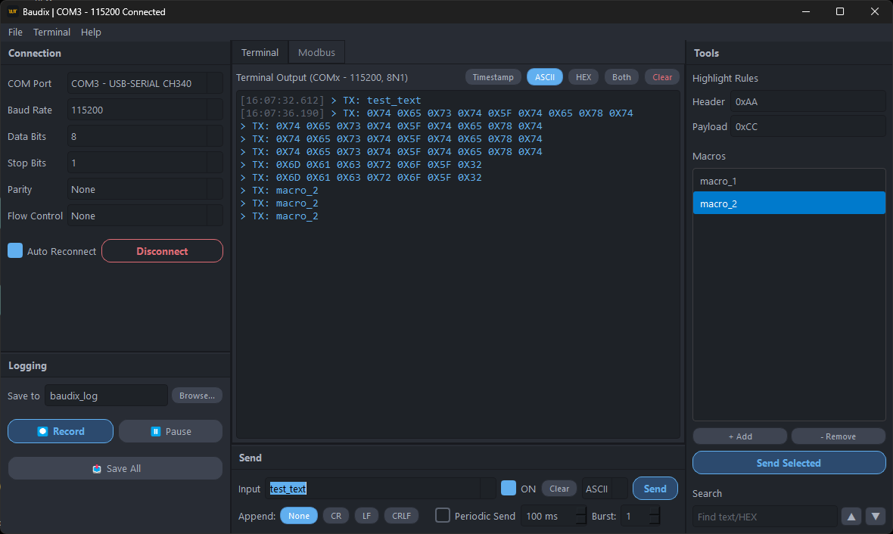

<div align="center">
  
  <h1>Baudix</h1>
  <p><b>Professional Serial Terminal for Embedded Systems</b></p>
  
  [](https://github.com/hakanyz/baudix/actions)
  [](https://isocpp.org/)
  [](https://www.qt.io/)
  [](LICENSE)
</div>

<br>

## Overview

Baudix is a modern Serial Port Terminal built with C++17 and Qt 6. It was developed to provide a clean, responsive, and developer-friendly environment for working with serial communications, debugging microcontrollers, and analyzing raw UART streams.

## Key Features

- **High-Performance IO:** Asynchronous serial port handling designed to process continuous data streams without freezing the user interface.
- **Dark Theme Ergonomics:** A custom UI built with Qt Stylesheets (QSS) for a comfortable dark mode experience during long debugging sessions.
- **In-App Updater:** An automated update system that queries GitHub Releases and performs silent background installations.
- **Macro System & Payloads:** Store and dispatch frequently used payloads (e.g., Bootloader triggers, firmware version requests) with a single click.
- **Logging & Snapshots:** Real-time stream recording, session pausing, and instant terminal snapshots for post-analysis debugging.
- **Hex/ASCII Parsing:** Real-time data conversion and custom RX/TX color highlighting to visually distinguish incoming and outgoing streams.
- **System Tray Integration:** Run the application silently in the background without cluttering the taskbar.

## Screenshots

<div align="center">
  
</div>

## Tech Stack & Architecture

- **Core Language:** C++17
- **Framework:** Qt 6 (Core, Gui, Widgets, Network, SerialPort)
- **Build System:** CMake
- **CI/CD:** GitHub Actions
- **Installer:** Inno Setup (Windows)

The core architecture relies on Qt's signal-slot mechanism to keep the main thread responsive while the `SerialPortController` handles I/O operations asynchronously. The update mechanism uses `QNetworkAccessManager` for secure API queries and binary processing.

## Build Instructions

### Prerequisites
- Qt 6.5+ (Requires SerialPort and Network modules)
- CMake 3.16+
- A C++17 compatible compiler (MSVC 2019+, GCC, or Clang)

### Compilation Steps

1. Clone the repository:
   ```bash
   git clone https://github.com/hakanyz/baudix.git
   cd baudix
   ```
2. Generate build files and compile:
   ```bash
   mkdir build && cd build
   cmake -DCMAKE_BUILD_TYPE=Release ..
   cmake --build . --config Release
   ```
3. The executable will be generated in the `build/` (or `build/Release/`) directory.

## Contributing

Contributions are welcome. Please ensure that UI modifications adhere to the established Baudix Dark Theme guidelines.

## License

This project is licensed under the GPL-3.0 License - Copyright (c) 2026 Hakan (hakanyz). See the LICENSE file for details.
